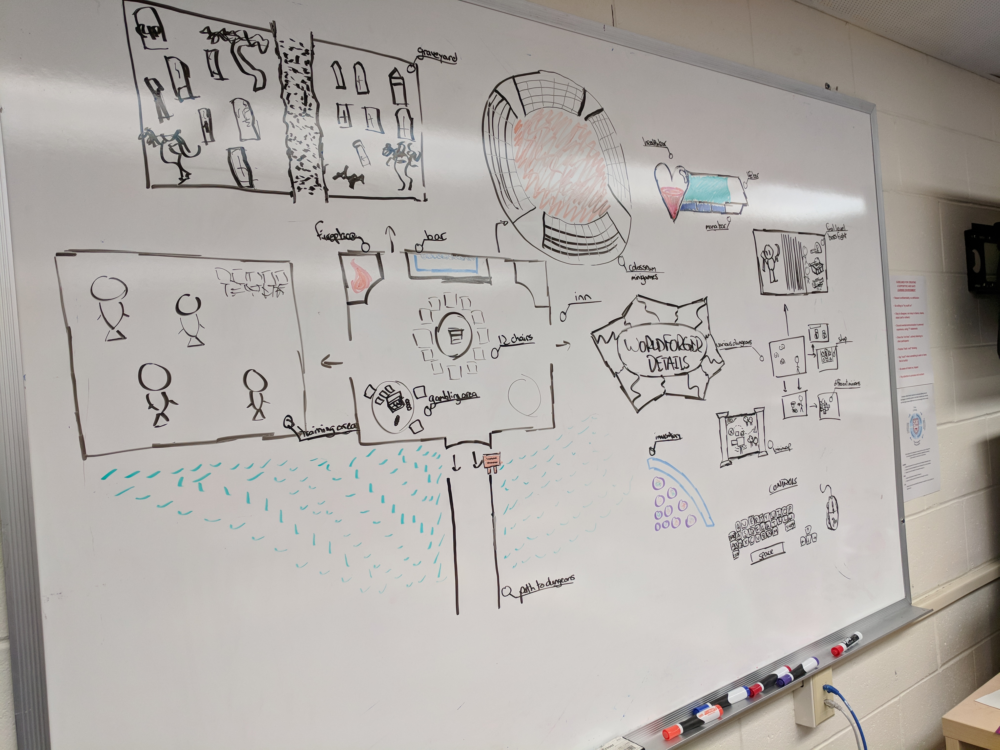
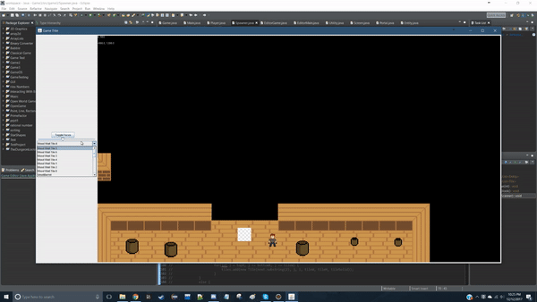
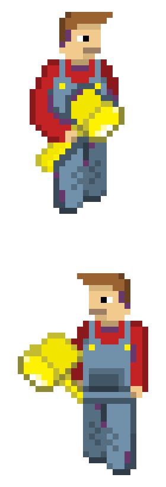
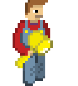
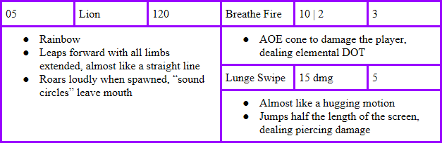
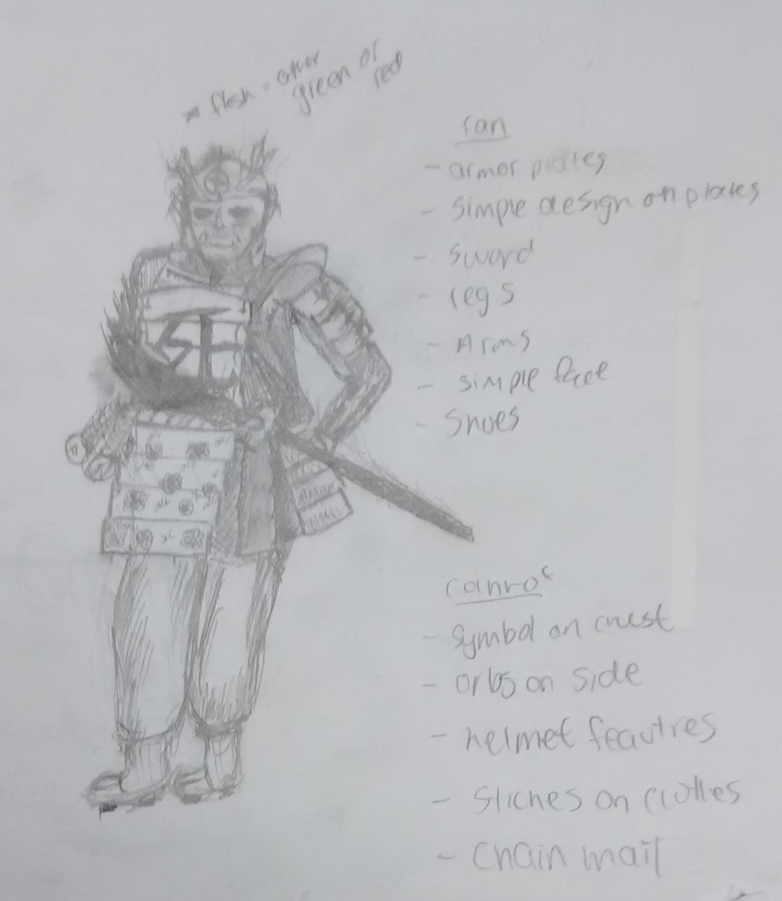
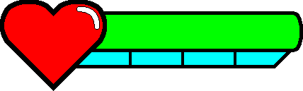

# Worldforger
Worldforger is a 2D RPG where the player must assist a political leader in taking control of their dystopian world.

# Game Description
Worldforger is a 2D roguelike/bullet-hell RPG drawn in a pixel-art style where the player takes on the role of a lone rogue in a post-dystopian country dominated by twelve political faction leaders. The game is built using our own custom-made engine in Java using the Eclipse IDE with art drawn in Photoshop. The target audience are those who like playing similar action-packed roguelikes like Binding of Isaac, Enter the Gungeon, Hades, etc., but are looking for a more story-centered experience. The game is meant to be played on PC using a keyboard and mouse. A narrative story leads the game, and twelve faction leaders to choose from means that the game is extremely replayable, offering 12 different endings and hundreds of different in-game scenarios.

# Narrative
The game itself takes place in a dystopian country, during the aftermath of a civil war. The country currently has no government, which leads to the player being tasked with installing a new political leader. There are twelve "bosses," each with their own dungeon, and the player can choose to take on these dungeons in any order. Each boss has their own radical ideology, introducted to the player during their first conversations with each boss. It is up to the player to defeat eleven of the bosses whose ideologies they oppose, ensuring that the last surviving leader is the one with the ideology that the player favors. The last boss standing becomes the leader of the new country, with the player by their side. In this way, the game is replayable, so that the player may access a different ending by supporting a different boss.

# Gameplay

The game features a substantial overworld area, in the center of which is a massive building referred to as "The Inn." In this building, the player has access to many different opportunities, such as purchasing goods, obtaining new weapons/armor, speaking to NPCs, training against enemies they've already faced, and more. The main purpose of this area is to serve as a home or starting zone for the player, which they will constantly return to after attempting a dungeon. Once the player leaves the Inn, they have the ability to choose from twelve different dungeons, each in a different direction relative to the Inn. The player can enter any of these dungeons whenever they want, and will only be allowed to leave the dungeon if they die or if they complete it. Each dungeon features randomly generated rooms and randomly generated enemies selected from a specially-made list for that individual dungeon. At the end of the dungeon is the boss, who plays a major part in the story. By defeating a dungeon boss, the player removes one of the twelve options for political leaders who will become the leader of the country. Once eleven dungeons have been completed, the player then "wins" the game, and is able to experience a different series of events that results from the choice that they have made. The one boss left alive becomes the leader of the country, and the player can see what it is like to let that specific political ideology rule over a country. The skill levels of the dungeons scale with each dungeon that the player has completed. Thus, regardless of which order the player chooses to defeat the dungeons in, they will always have greater difficulty tackling each dungeon than the previous one. Here is a very basic sample of player movement and shooting in a dungeon:

# Circumstances

I worked on this game in high school with a group of 5 other people, who each offered a little bit to the development process. However, we were all new to game development in general, so we took a long time with basically everything. Some of us had an interest in programming, others in art, and others in design. I helped with all three categories, with the most effort in art and design. I did help a lot in the programming aspect of figuring out how to translate my art into the game engine. Overall, we spent the most time with the design process of the game rather than the development process, resulting in a well-thought-out game, but not much to show for it. Here is an example of the work we put into production:

# Game Creation (Java)

At the time that we made this game, we were completely new to game development in general, so we did not realize the benefits of using a well-designed game engine such as Unity. Since we had experience in Java, we decided to make our own game engine using Eclipse. We created a user interface that allowed us to input a spritesheet and split it into individual sprites. This allowed us to design a full spritesheet PNG in Photoshop and split the sprites ourselves after accessing the game file. Then, we designed a feature that allowed us to drag and drop these individual sprites onto a "level," which was the section of the game that was loaded at the time. These sections were uniquely saved, so we also were able to make a system that allowed us to get from one level to the next once the player reached a certain point of a level. Finally, our engine allowed us to package our system into a JAR file, and play it with an EXE. Here is an example drag-and-drop using our engine:

Our game worked on a tick-by-tick basis, meaning that every second that passed in the internal clock of the system, a certain number of in-game ticks were processed. Using this system, we could have interactions between characters and objects and also allowed us to animate our sprites by displaying a new sprite on the exact position of the existing one after a certain small interval, such as 0.10 seconds. Here is an example of a sprite animation:

As mentioned earlier, we were able to allow for interactions between sprites, so we could make sprites attack and be attacked. As far as combat goes, we were not able to make a functioning health system, so any sprite, including the player character, would die when hit just once. However, we were able to make a basic AI system for our enemies. Some enemies would just walk around randomly, but some enemies would detect the existence of the player character and move towards them, then attack once they are in a given range. Here is an example of the same sprite as earlier in an attack animation:

# Game Creation (Photoshop)

Since this was our first game development experience, we did not know the most functional way to create good art. However, we made a nice system of creating art where we first would theorize the entirety of what we were going to draw first. Here is an example of planning an enemy for a certain dungeon:

Once we had planned out everything about the character, we then drew physical concept art for the character. We thought about how the character would act like if they were in the real world, and we also considered what emotions we wanted that character to evoke in the player. We spent the majority of the time in this phase, so that we could consider all the possibilities we could think of for each character. Here is an example of concept art for a character:

After we finalized what we wanted the character to look like, we went into Photoshop and began drawing it. At this point in time, we were all very new to art, so we did not know about choosing a specific color palette or determining which art style fits our game well. Instead, we just tried out random things with pixel art until we found something that we could see going into the real game. Examples of animations of our finalized pixel art can be seen above in the Game Creation (Java) category. We even designed an entire UI system for our game, although we were not able to port any of it into the game engine. Here is an example of a custom health bar animation:

The entire collection of art we drew for the game can be found in the ./art folder linked above in this repo. All the files for the game engine can be found in the ./code folder.
